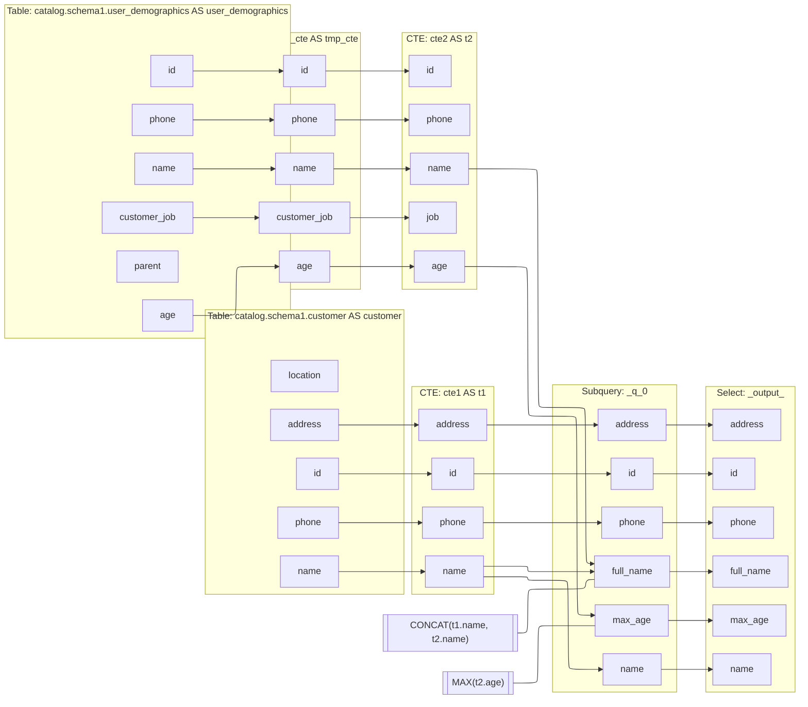

## Sql Data Lineage Example

### Run
```bash
datalineage -i example/test-query.sql --schema-path example/test-schema.json
```

An mermaid flowchart code will be printed into the console. We can copy the graph and paste to the Mermaid Live Editor to preview the result.

### Display [[live editor](https://mermaid.live/edit#pako:eNqFVtGOmzoQ_RWEtFIrpVnbGEPyUGnV27fbVuruQ9WlQg44CS1gCuberqL8e8fepmo9eJcn8Az2nDNnxnOKK12reBtfXZ2avjHb6FTE-1b_Xx3laIrYfddqL-fWfFR9rUY12tUiVu23Ij6fo_PVVdEfRjkco38_Fv007x4_KBOEsZymPBObDYvui_hO7lq1jSppZKsP66k6qk7SdTVPRndqjG5uo8t7EX8p-j-3yDcCdmhqbOA5GHrZKd-UkdyahqPukU1QZm2yrkc1Tdia2dNaDaE2undmAF_0AXw5IRbfm7u3gM4oapEYiuPhZBlDwkgAg0hEGAOnwsPggvRoi169eh15YSAKfScbEiITO4kcsYqcIMogcSR5ShjzpMayVp12PzbVZHlFiz4tabZhizSnm0QEaE5zlxp5wBbhhLeYgDTjHGwXzZZf9Q7_TuzGgxxVb57VERf8t45MN5SgJSelx1eMJ-fLQEWwJpLMKXsJaJqyIFCeiiWgvtws9X7-bZQoDcgJIkYJ8Z1s7Cg3aCeAgZKEnABPMAmQsj-LmbkMMEwXCZCfiFAxp5zky-QnGQuWeZpQm5gg58AvJoFwpAjkBIEibWCmSI5kghPDcqQXfBxlYc6p6wO38-77rMaHbVR-LwkiKc-WC5sTwQOUc0KD5QuNiYTvAE4d7fu5bcvFnZmriU7-KC8J9VNjOy3iCkCg5u87WUDoGsBOVKD7ADlRL8kWVql-DPdW4h_ev7m5e2Ho2gJcgcrdy0sA8wU2gify_nw-ct_JquxZJ8vlJah3N59eQCDAaSgOlgpUVugI9kSFk9xV-K1qVQUTT6lnM8ymRBlO0oDeGAn1V564trCst8z165DeuLtownpL3bX2lN6sthARidcPrbYwW16VW23hnbymYrWFnLKcI70hJ4CK8o-cAG-8iuG66WRTw4R6KvoI5k4Ds4F6HEGrh50ah7mHQbToz-AsZ6NvH_oq3ppxVqt41PPhePmYh1oa9U8jQRDd34tv68boMd7uZTvBYqslDLrx9hSbh8EOx4dmMrB9pft9c7Dr89jC8tGYYdpeX1vz-tCY47xbV7q7npraTs_H_zbiWjCRS5YokSUyTZK62tFNvmec7uuMUCZhhF7Fyp3_7nESdwP5CkaG_rPW3a-gzj8BvuAUxg) - [view only](https://mermaid.live/view#pako:eNqFVtGOmzoQ_RWEtFIrpVnbGEPyUGnV27fbVuruQ9WlQg44CS1gCuberqL8e8fepmo9eJcn8Az2nDNnxnOKK12reBtfXZ2avjHb6FTE-1b_Xx3laIrYfddqL-fWfFR9rUY12tUiVu23Ij6fo_PVVdEfRjkco38_Fv007x4_KBOEsZymPBObDYvui_hO7lq1jSppZKsP66k6qk7SdTVPRndqjG5uo8t7EX8p-j-3yDcCdmhqbOA5GHrZKd-UkdyahqPukU1QZm2yrkc1Tdia2dNaDaE2undmAF_0AXw5IRbfm7u3gM4oapEYiuPhZBlDwkgAg0hEGAOnwsPggvRoi169eh15YSAKfScbEiITO4kcsYqcIMogcSR5ShjzpMayVp12PzbVZHlFiz4tabZhizSnm0QEaE5zlxp5wBbhhLeYgDTjHGwXzZZf9Q7_TuzGgxxVb57VERf8t45MN5SgJSelx1eMJ-fLQEWwJpLMKXsJaJqyIFCeiiWgvtws9X7-bZQoDcgJIkYJ8Z1s7Cg3aCeAgZKEnABPMAmQsj-LmbkMMEwXCZCfiFAxp5zky-QnGQuWeZpQm5gg58AvJoFwpAjkBIEibWCmSI5kghPDcqQXfBxlYc6p6wO38-77rMaHbVR-LwkiKc-WC5sTwQOUc0KD5QuNiYTvAE4d7fu5bcvFnZmriU7-KC8J9VNjOy3iCkCg5u87WUDoGsBOVKD7ADlRL8kWVql-DPdW4h_ev7m5e2Ho2gJcgcrdy0sA8wU2gify_nw-ct_JquxZJ8vlJah3N59eQCDAaSgOlgpUVugI9kSFk9xV-K1qVQUTT6lnM8ymRBlO0oDeGAn1V564trCst8z165DeuLtownpL3bX2lN6sthARidcPrbYwW16VW23hnbymYrWFnLKcI70hJ4CK8o-cAG-8iuG66WRTw4R6KvoI5k4Ds4F6HEGrh50ah7mHQbToz-AsZ6NvH_oq3ppxVqt41PPhePmYh1oa9U8jQRDd34tv68boMd7uZTvBYqslDLrx9hSbh8EOx4dmMrB9pft9c7Dr89jC8tGYYdpeX1vz-tCY47xbV7q7npraTs_H_zbiWjCRS5YokSUyTZK62tFNvmec7uuMUCZhhF7Fyp3_7nESdwP5CkaG_rPW3a-gzj8BvuAUxg)]


